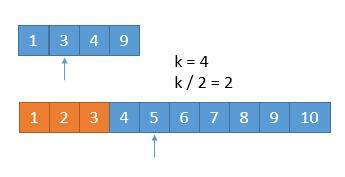
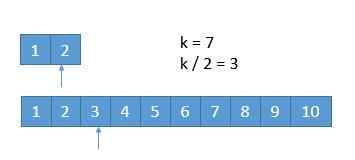

# 寻找两个有序数组的中位数

## 题目描述

给定两个大小为 m 和 n 的有序数组`nums1`和 `nums2`

请你找出这两个有序数组的中位数，并且要求算法的时间复杂度为 `O(log(m + n))`

你可以假设`nums1`和`nums2`不会同时为空。

示例 1:

```java
nums1 = [1, 3]
nums2 = [2]

则中位数是 2.0
```

示例 2:

```java
nums1 = [1, 2]
nums2 = [3, 4]

则中位数是 (2 + 3)/2 = 2.5
```

来源：[寻找两个有序数组的中位数](https://leetcode-cn.com/problems/median-of-two-sorted-arrays)


## 解题思路

本题需要我们去找两个数组的中位数，第一个想到的当然是两个数组从左到右归并排序，然后取最中间的元素即为中位数，这种解法需要遍历完整的两个数组，时间复杂度为`O(m + n)`，没有达到题目要求的`O(log(m + n))`。

事实上，看到`O(log(xx))`，我们就应当想到使用二分法来解决问题，中位数这个概念又是十分的契合二分解决，因此使用二分法来解题是自然而然的。

那么如何应用二分法呢，也许会有许多不同的解法，这里我借鉴”查找第K小的元素“算法，使用二分法每次排除`k/2`个元素，最终有一个数组为空，或者k等于1（即变成寻找最小元素）时，停止递归。

例如：

假设我们要找第 7 小的数字。


我们比较两个数组的第 `k/2`个数字，上边数组中的 `4` 和下边数组中的 `3`，如果哪个小，就表明该数组的前 `k/2` 个数字都不是第 k 小数字，所以可以排除。将 `1` `3` `4` `9` 和 `4` `5` `6` `7` `8` `9` `10` 两个数组作为新的数组进行比较。

橙色的部分表示已经去掉的数字。



由于我们已经排除掉了 3 个数字，就是这 3 个数字一定在最前边，所以在两个新数组中，我们只需要找第 7 - 3 = 4 小的数字就可以了，也就是 k = 4。此时两个数组，比较第 2 个数字，3 < 5，所以我们可以把小的那个数组中的 1 ，3 排除掉了。


我们又排除掉 2 个数字，所以现在找第 4 - 2 = 2 小的数字就可以了。此时比较两个数组中的第 k / 2 = 1 个数，4 == 4，怎么办呢？由于两个数相等，所以我们无论去掉哪个数组中的都行，因为去掉 1 个总会保留 1 个的，所以没有影响。为了统一，我们就假设 4 > 4 吧，所以此时将下边的 4 去掉。


由于又去掉 1 个数字，此时我们要找第 1 小的数字，所以只需判断两个数组中第一个数字哪个小就可以了，也就是 4。所以第 7 小的数字是 4。


我们每次都是取 k/2 的数进行比较，有时候可能会遇到数组长度小于 k/2的时候。



此时 k / 2 等于 3，而上边的数组长度是 2，我们此时将箭头指向它的末尾就可以了。这样的话，由于 2 < 3，所以就会导致上边的数组 1，2 都被排除。造成下边的情况。


由于 2 个元素被排除，所以此时 k = 5，又由于上边的数组已经空了，我们只需要返回下边的数组的第 5 个数字就可以了。

从上边可以看到，无论是找第奇数个还是第偶数个数字，对我们的算法并没有影响，而且在算法进行中，k 的值都有可能从奇数变为偶数，最终都会变为 1 或者由于一个数组空了，直接返回结果。

所以我们采用递归的思路，为了防止数组长度小于 k/2，所以每次比较 `min(k/2，len(数组)` 对应的数字，把小的那个对应的数组的数字排除，将两个新数组进入递归，并且 k 要减去排除的数字的个数。递归出口就是当 k=1 或者其中一个数字长度是 0 了。

代码如下：

```java
public double findMedianSortedArrays(int[] nums1, int[] nums2) {
        int m = nums1.length;
        int n = nums2.length;
        int odd = (n + m + 1) / 2; // 共有奇数个元素
        int even = (n + m + 2) / 2; // 共有偶数个元素
        // 奇数偶数情况合并
        return (
                getKth(nums1, 0, m-1, nums2, 0, n-1, odd) //奇数情况
                +
                getKth(nums1, 0, m-1, nums2, 0, n-1, even) //偶数情况
                ) * 0.5;
    }

    private double getKth(int[] nums1, int start1, int end1, int[] nums2, int start2, int end2, int k){
        int length1 = end1 - start1 + 1;
        int length2 = end2 - start2 + 1;
        // 使length1始终小于length2，确保若有数组为空，则一定是nums1
        if (length1 > length2){ return getKth(nums2, start2, end2, nums1, start1, end1, k); }
        // 若nums1为空，直接返回nums2的第k个元素
        if (length1 == 0){ return nums2[start2 + k - 1]; }
        //若k = 1，直接返回两个数组最左侧元素中的最小值
        if (k == 1){ return Math.min(nums1[start1], nums2[start2]); }

        // 分别求两个数组的第k小数的位置，若数组长度不足K/2，则指向数组末尾
        int i = start1 + Math.min(length1, k/2) - 1;
        int j = start2 + Math.min(length2, k/2) - 1;

        if (nums1[i] > nums2[j]){
            // 说明第k小的数不会出现在nums2[start2...j]之间，排除掉这些元素
            // 排除掉了j - start2 + 1个元素，现在只需要找到第k - (j - start2 + 1)小的元素就ok
            return getKth(nums1, start1, end1, nums2, j + 1, end2, k - (j - start2 + 1));
        }else {
            // 说明第k小的数不会出现在nums1[start1...i]之间，排除掉这些元素
            // 排除掉了i - start1 + 1个元素，现在只需要找到第k - (i - start1 + 1)小的元素就ok
            return getKth(nums1, i + 1, end1, nums2, start2, end2, k - (i - start1 + 1));
        }
    }
```

来源：力扣（LeetCode）

作者：windliang